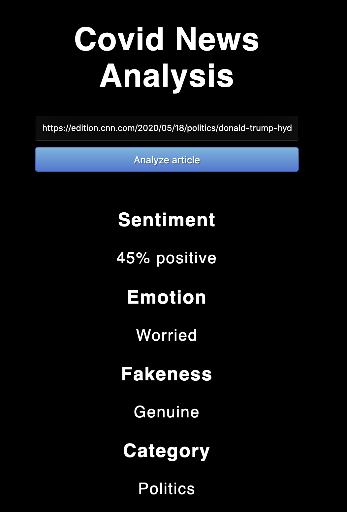

# covid-news-analyzer
Analyze news articles related to covid-19 based on different metrics:

1. Sentiment Analysis
2. Emotion Detection
3. News Article Categorization
4. Fakeness

----
## How To Run

Install requirements from `requirements.txt` using `pip install -r requirements.txt` and run:

### Training
```bash
python -u main.py --dataset <dataset_name> --models <models> --feats <transformations> --save_path <model_path> --save_results
```

- <dataset_name> can be one of `emo_aff, stan_sent, news_cate, fake_news` representing the standard datasets used to train the models
- <models> is a space separated list of models to train - mnb, svm, xgb, ada, rf, lr
- <transformations> is a space separated list of feature transformations to use - bow, tfidf, ngram

This would train the specified list of models on all the specified feature transformations for the given dataset, and save the results in a csv file, as well as the performing model on the test portion of the dataset.

## Evaluation
Run `python evaluate.py` to obtain the predictions on the COVID-19 article test set, and use `python analysis/analyze.py` to obtain the evaluation scores.

## Web Portal
Run `python wsgi.py` to launch the web portal. This lets you analyze a specific article against trained models placed in `output/model_dump` directory.


